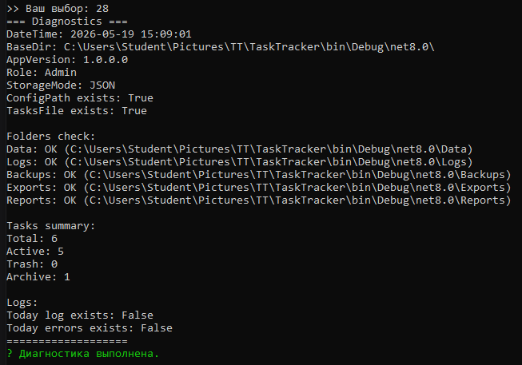

# 📌 TaskTracker

> Консольное приложение для управления задачами с поддержкой фильтрации, корзины, архива, диагностики и сбора отчётов.

## ✨ Возможности

| Функция | Команда | Описание |
|---------|---------|----------|
| **Основные операции** | `1`, `2`, `4` | Добавление, просмотр активных, удаление (в корзину) |
| **Фильтрация** (ЛР23) | `19`, `20` | Расширенный фильтр по тексту и статусу, повтор последнего фильтра |
| **Корзина** (ЛР24) | `21`, `22`, `23` | Просмотр, восстановление, очистка корзины (с подтверждением) |
| **Архив** (ЛР25) | `24`, `25`, `26` | Архивирование, просмотр архива, возврат из архива |
| **Диагностика системы** (ЛР27) | `28` | Проверка версии, доступ к папкам, состояние задач, наличие логов |
| **Отчёт поддержки** (ЛР27) | `29` | Генерация текстового отчёта (папка `reports/`) |
| **Справка** (ЛР26) | `27` | Встроенная справка по всем командам |

## 🖥️ Интерфейс

- Цветное меню с группировкой по разделам
- Безопасный ввод ID (защита от букв)
- Понятные сообщения об успехе/ошибке

## 🩺 Диагностика и отчёты

**Команда `28`** – выводит подробную информацию о системе:
- Базовая директория, версия приложения, роль пользователя
- Существование и доступность папок (Data, Logs, Backups, Exports, Reports)
- Количество задач (всего, активных, в корзине, в архиве)
- Наличие сегодняшних лог-файлов

**Команда `29`** – создаёт файл `SupportReport_YYYY-MM-DD_HH-mm-ss.txt` в папке `reports` с теми же данными. Удобно для передачи разработчику.

## 📁 Структура проекта

   

   
🧪 Тестирование функционала
Добавьте пару задач (команда 1).

Посмотрите активные (2).

Удалите одну задачу (4) → проверьте корзину (21).

Восстановите (22) или очистите корзину (23).

Заархивируйте задачу (24) → архив (25) → верните (26).

Выполните диагностику (28) → убедитесь, что все папки и файлы видны.

Создайте отчёт поддержки (29) → найдите файл в папке reports.

   

  

   

   
